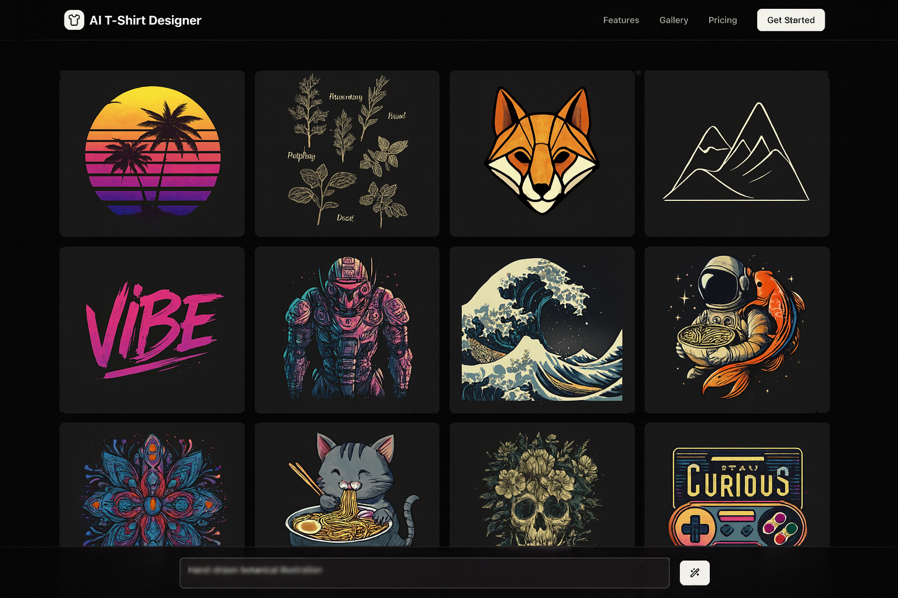

# AI T-Shirt Designer

Create amazing t-shirt designs using artificial intelligence! Just describe what you want, and the AI will generate unique designs for you.



## What This App Does

This is a web app that helps you create t-shirt designs using AI. Here's how it works:

1. **Tell the AI what you want**: Write a description like "a lion with geometric patterns" or "abstract sunset"
2. **AI creates designs**: The app uses OpenAI to generate 12 different artistic designs based on your idea
3. **See your designs**: View all designs in a nice grid layout with realistic t-shirt mockups
4. **Download and use**: Get high-quality images ready for printing

## Key Features

- **AI-Powered Design**: Uses OpenAI's latest image generation technology
- **Real-time Generation**: Watch your designs appear one by one as they're created
- **Smart Prompts**: The AI creates artistic, print-ready designs optimized for t-shirts
- **Beautiful Interface**: Modern, easy-to-use design with dark/light theme support
- **Mobile Friendly**: Works great on phones, tablets, and computers
- **High Quality**: Generates print-ready images suitable for commercial use

**Note:** This project is currently under development.

## How to Set Up

### What You Need

- Node.js (version 18 or newer)
- An OpenAI API key (get one from [OpenAI's website](https://platform.openai.com/))

### Installation Steps

1. **Download the code**:

   ```bash
   git clone <your-repo-url>
   cd tshirt-designer
   ```

2. **Install required packages**:

   ```bash
   npm install
   ```

3. **Set up your API key**:

   - Copy the `env.example` file and rename it to `.env.local`
   - Add your OpenAI API key:
     ```
     OPENAI_API_KEY=your_openai_api_key_here
     ```

4. **Start the app**:

   ```bash
   npm run dev
   ```

5. **Open in browser**:
   Go to [http://localhost:3000](http://localhost:3000)

## How to Use

1. **Start Designing**: Click "Start Designing" on the home page
2. **Describe Your Idea**: Type what you want your t-shirt to look like (e.g., "space galaxy with stars")
3. **Generate**: Click the "Generate Design" button
4. **Wait**: The AI will create 12 different designs (takes about 2-3 minutes)
5. **View Results**: Click on any design to see it bigger
6. **Save**: Right-click and save any design you like

### Tips for Better Results

- Be specific: "vintage coffee cup with steam" works better than just "coffee"
- Mention colors: "blue ocean waves" or "golden sunset"
- Include style words: "minimalist", "vintage", "geometric", "watercolor"
- Think about placement: designs work best when they're centered on the chest

## Technology Used

This app is built with modern web technologies:

- **Next.js 15**: React framework for the website
- **TypeScript**: For better code quality and error checking
- **Tailwind CSS**: For beautiful, responsive styling
- **OpenAI API**: For AI image generation and also prompt generation
- **Framer Motion**: For smooth animations
- **Radix UI**: For accessible user interface components

## Project Structure

```
tshirt-designer/
├── src/
│   ├── app/                 # Main app pages
│   │   ├── page.tsx        # Home page
│   │   ├── design/         # Design creation page
│   │   └── api/            # API endpoints
│   ├── components/         # Reusable UI components
│   ├── lib/               # Utility functions and API clients
│   └── hooks/             # Custom React hooks
├── public/                # Static files (images, icons)
└── package.json          # Project dependencies
```

## API Endpoints

The app includes several API endpoints:

- `/api/generate-images`: Creates t-shirt design images
- `/api/generate-images-stream`: Streams images as they're generated
- `/api/generate-prompts`: Creates artistic prompts from user input
- `/api/sample-prompts`: Provides example prompts for inspiration

## Development Commands

- `npm run dev`: Start development server
- `npm run build`: Build for production
- `npm run start`: Start production server
- `npm run lint`: Check code for errors

## Customization

You can easily customize this app:

- **Change colors**: Edit the Tailwind CSS theme in `tailwind.config.js`
- **Add features**: Create new components in the `src/components` folder
- **Modify prompts**: Update the AI prompt templates in `src/lib/openai.ts`
- **Add pages**: Create new pages in the `src/app` folder

## Troubleshooting

**Images not generating?**

- Check your OpenAI API key is correct
- Make sure you have credits in your OpenAI account
- Check the browser console for error messages

**App not starting?**

- Make sure Node.js is installed (version 18+)
- Run `npm install` to install all packages
- Check that port 3000 is not being used by another app

**Slow generation?**

- This is normal! AI image generation takes time
- Each design takes about 10-15 seconds to create
- The app generates 12 designs, so expect 2-3 minutes total

## License

This project is open source. Feel free to use it for your own projects!
